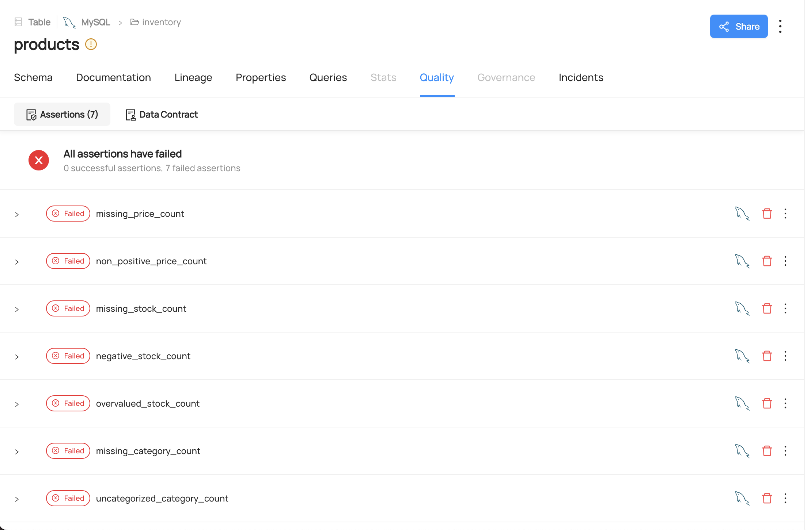
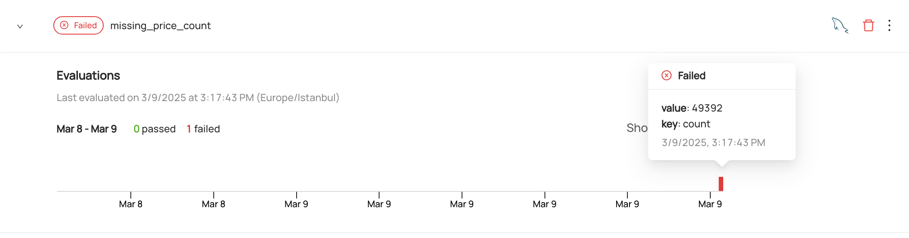

# **Overview**

The project is designed to support an end-to-end data quality validation workflow on a **MySQL-based** *`inventory`* database that serves as a source for DataHub metadata ingestion. It combines containerized services (*using Docker Compose*) and a Python application that performs validations on data extracted from the database. The primary steps include:

- Setting up environment variables (*defined in `.env`*) and Docker containers via `docker-compose.yaml.`
- Preparing the MySQL `inventory` table using a dedicated script (*`_prepare_database.py`*).
- Running the main application (*`app.py`*) which utilizes `SQLAlchemy` to retrieve data in chunks and `pandas` for vectorized processing.
- Reporting results of custom data quality checks as assertions to DataHub through the `DataHub API` ingestion.

# **Main Logic and Workflow**

- **Initialization:** The application loads the controller configurations (from *`/app/controllers/config`*) and instantiates an executor with the configuration.
- **Controller Executions:** For each defined controller, the executor handles database connections, data retrieval, and custom validation methods to perform quality checks. The executor also upserts data and reports assertion results to DataHub.


# **Vectorized and Batch Processing Mechanism**
### Batch Processing
The use of SQLAlchemy in combination with pandas’ chunked reading (*using pd.read_sql with chunksize*) allows the application to retrieve large datasets in manageable batches. This approach reduces memory usage compared to loading the entire dataset at once.

### Vectorized Operations
Pandas vectorized functions are utilized throughout the controllers. Operations such as counting null values, verifying column conditions (e.g., non-positive prices or overvalued stock), and applying conditional checks are executed using pandas built-in vectorized methods.

# **Design**

### Factory Pattern 

- **For Database:** The `DatabaseFactory` and its implementation (*`MySQLDatabaseFactory`*) are responsible for creating SQLAlchemy engine instances and connections. 

- **For Controllers:** A `ControllerFactory` is employed to register and create controllers (*like `ProductController`*), allowing separation of data validation logic.

### Dynamic Controller Executions
Controllers are custom data quality entities responsible for specific elements, such as tables and their respective columns. They are managed through the `ControllerFactory`. An executor is responsible for executing the registered controllers. The controller logic, including details such as which column is controlled by which method, the connection points, and the target tables to fetch data from, is defined using a YAML configuration file.

When the application needs to be extended—such as when new controllers are required—the only tasks are to create a new controller for the target table, define the specifications in the YAML file, and add it to the `ControllerFactory`. The executor will handle the rest of the process.

This design allows for the separation of control logic and the execution of the controllers.


# **Components**

#### setup/docker-compose.yaml
Constructed based on the official Compose YAML (*reference: [official file](https://raw.githubusercontent.com/datahub-project/datahub/master/docker/quickstart/docker-compose-without-neo4j-m1.quickstart.yml)*) and was modified to include an additional simple MySQL container as a source database:
  ```yaml
  source_mysql:
    image: mysql:8.0
    environment:
      MYSQL_ROOT_PASSWORD: root
      MYSQL_DATABASE: inventory
    ...
    volumes:
      - source_mysql:/var/lib/mysql
  ```
---

#### recipes/inventory.yml

Configuration for metadata ingestion into DataHub. It specifies the MySQL source and the DataHub REST sink.

---

#### app/database.py
- Responsible for handling Database interactions.
- Uses the factory design pattern to establish database connections via SQLAlchemy.
- Provides methods for creating engine, connections and data retreival.

---

#### app/controllers/*.py
- Reponsible for handling data quality controls.

Base Controller:
- Provides common tools for data validation like checking for missing or negative values.
- Implements helper methods used by all other controllers.

Product Controller:
- Focuses on validating product data (e.g., price, stock, category).
- Inherits from the Base Controller so it already has standard validation tools, and then adds specific methods for product-related checks.

Controller Factory:
- Dynamically creates controller instances based on a configuration.
- Uses a simple mapping between names and classes along with external YAML files (like product.yaml) to set parameters, making the system easy to extend or modify.

---

#### app/controllers/config/config.yaml
- Contains YAML-formatted configuration file for different controllers, including details such as the controller name, table name, columns, and the necessary specifications for the desired controller.
- Enables seamless addition or modification of controllers by simply adding or updating the corresponding YAML configuration file.

```yaml
controllers:
  - class_name: string                  # Name of the controller (e.g., "ProductController")
    db_type: string                     # Type of the database (e.g., "mysql", "postgres")
    db_user: string                     # Database username for authentication
    db_password: string                 # Database password for authentication
    db_host: string                     # Host address of the database (e.g., "localhost")
    db_port: integer                    # Port number of the database connection
    db_name: string                     # Database name to connect with
    conn_idle_timeout: integer          # Idle timeout (in seconds) for the database connection
    table_name: string                  # Target table name in the database
    chunk_size: integer                 # Batch size for data processing (e.g., 20000 rows per chunk)
    datahub_server_url: string          # URL of the DataHub server (e.g., "http://localhost:8080")
    datahub_platform_urn: string        # DataHub platform URN (e.g., "urn:li:dataPlatform:mysql")
    datahub_entity_urn: string          # DataHub dataset URN (e.g., "urn:li:dataset:(urn:li:dataPlatform:mysql,inventory.products,PROD)")
    column_operations:                  # List of columns and associated controls
      - name: string                    # Column name in the database (e.g., "price", "stock")
        controls:                       # List of control checks for validation
          - name: string                # Control name describing the validation (e.g., "missing_price_count")
            responsible_method: string  # Method name responsible for executing the check (e.g., "count_null_prices")
```

---

#### app/assertion_handler.py
- Handles communication with DataHub using the `DataHubGraph` client.
- Includes methods for upserting custom assertions and reporting results of custom assertions.

#### app/executor.py
- Manages the overall validation process.
- Initializes controllers based on configuration, using a factory pattern to decouple controller creation.
- Iterates through each controller to open database connections and fetch data in manageable chunks.
- Validates data by applying control methods from the controller's and aggregates validation results.
- Manages integration with external assertion services by upserting and reporting assertion results.
- Provides centralized orchestration for executing data quality checks.

---

#### app/app.py

- Serves as the entry point that ties configuration, execution, and result reporting together.
- Loads controller configuration from a YAML file to set up data quality checks.
- Initializes an Executor with the configuration, delegating the core processing logic.
- Orchestrates the execution of validation routines, assertion upsert, and assertions reporting.


# **Configurations**

### Source MySQL
The MySQL instance, which serves as the metadata source for the project, runs on **`localhost:3377`**. Its configuration is kept basic to maintain project simplicity, with the **username** set to **`root`** and the **password** to **`root`**. It can be queried using a client (*e.g., `DBeaver`*) once the above specifications are properly configured.

---

### Logging
A logging mechanism is established in the project. Processes can be tracked step-by-step through logs.

For example (for 1M records):

    2025-03-09 14:35:42 - [QUALITY_CHECKS] - INFO - Execution time: 5.25 seconds.

---

### _prepare_database.py

The script connects to a MySQL database, creates a products table if it does not exist, clears its contents, generates random product data, and inserts 1,000,000 records. 

**id:** `AUTO_INCREMENT`

**name:** The name column is generated using a simple formatted string. Example, `f'Product {i}'`

**category:** The category column is populated randomly from the combined list of *valid_categories* and *invalid_categories*. There is no weighting or probability involved.

**price:** The price column is created using random.choices(). 95% of the time, a price is selected as floating-point number between -50.0 and 500.0. This value is rounded to two decimal places. 5% of the time, None is selected, simulating missing data for the price.

**stock:** The stock column is also created using random.choices(). 95% of the time, stock value is selected as integer between -50 and 5000. 5% of the time, None is chosen, simulating missing data for the stock quantity.

# **Running & Observations**

## Prerequisites

- **Docker** must be installed on your computer.
- **Python** must be installed to create a virtual environment.

## Running the Application

### 1. Running `setup.sh`

A shell script is prepared to kick off the project easily. It performs the following steps:

1. Create and activate a virtual environment.
2. Upgrade essential Python tools (`pip`, `wheel`, `setuptools`).
3. Install project dependencies from `requirements.txt`.
4. Start Docker containers using `docker-compose`.
5. Prepare the database by running the setup script (`_prepare_database.py`).
6. Ingest data into DataHub from a YAML configuration file (`inventory.yml`).
7. Run the main application (`app/app.py`).


#### Notes

- To run the `setup.sh` script, use the following command:
  ```bash
  chmod +x setup.sh

- You can monitor the process through the shell logs.

Once `setup.sh` finishes execution, a data quality report for the products table will be generated. This indicates that the setup is complete, and you can proceed to the datahub observation phase.

## 2. DataHub Observations

Once the application has finished running, the table quality report will be ready. It can be observed through the following screenshots:


*Custom assertions within the Quality section of the target table.*


*The application displays validation results(count) for custom assertions.*

# **Evicting the Resources** 
## Running `nuke.sh`

The `nuke.sh` script is designed for evicting the resources and tearing down the project environment. It performs the following steps:

1. Stops and removes Docker containers, volumes, and orphaned containers.
2. Deletes the virtual environment.

#### Notes

- To run the `nuke.sh` script, use the following command:
  ```bash
  chmod +x nuke.sh
- You can monitor the process through the shell logs.
Once nuke.sh finishes execution, the environment and all associated resources will be removed!